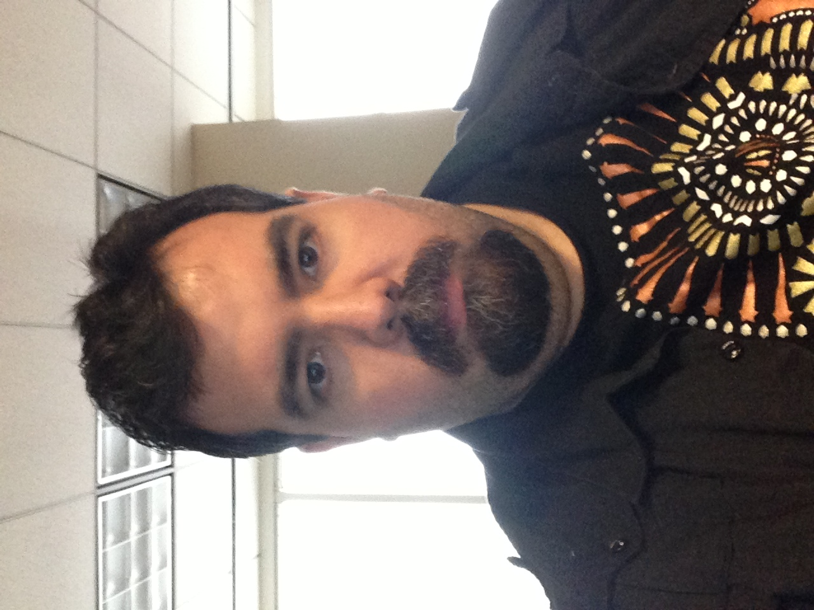

# **Going Mobile with Flutter and Rust**

Flutter Rust Bridge

By Allan Davis

---

# Introduction

## Allan Davis
* Lead Engineer: Haulink
* Rust Game Developer: Shadeaux Media
* 20 Years of experience
* Gitlab: cajun_code
* Github: cajun-code
* Linked In: cajuncode

---

# Agenda

* What is Flutter
* What is the rust bridge
* Demo
* Q & A

---

# What is Flutter 

* Cross platform application UI framework
* Uses Dart for everything
* https://flutter.dev
* https://pub.dev

---

# Flutter Rust Bridge

* Easy way to transmit data between our native code and Flutter
* Remove the need for platform-specific language (like C++/Kotlin/Swift/etc)

---

# Simple Hello Demo

---

# Questions and Answers

---

# Thanks

## Slides and code
## https://github.com/cajun-code/FRB_book